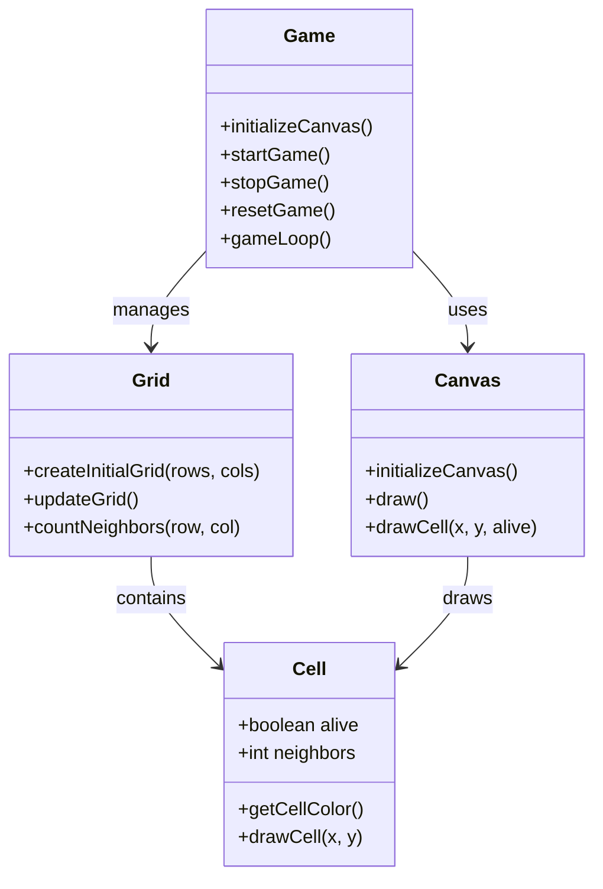

# Conway's Game of Life

A web-based implementation of Conway's Game of Life using HTML5 Canvas.

## Features
- Interactive grid visualization
- Color-coded cells based on neighbor count
- Responsive design that adapts to window size
- Simple controls for starting, stopping, and resetting the simulation

## Implementation Details
- Built with vanilla JavaScript, HTML5, and CSS
- Uses requestAnimationFrame for smooth animation
- Implements toroidal grid (edges wrap around)
- Configurable parameters for cell size, animation speed, and initial population

### Code Class Diagram

## Getting Started
1. Clone the repository
2. Open index.html in a modern web browser
3. Use the control buttons to interact with the simulation:
   - Start: Begin the simulation
   - Stop: Pause the current state
   - Reset: Generate a new random initial state

## Current Rules
- Any live cell with fewer than two live neighbors dies (underpopulation)
- Any live cell with two or three live neighbors lives
- Any live cell with more than three live neighbors dies (overpopulation)
- Any dead cell with exactly three live neighbors becomes alive (reproduction)

## Contributing
1. Fork the repository
2. Create a feature branch
3. Make your changes
4. Submit a pull request

## Development Standards
- Follow the established code style
- Document new functions with JSDoc comments
- Test changes across different browsers
- Ensure responsive design is maintained